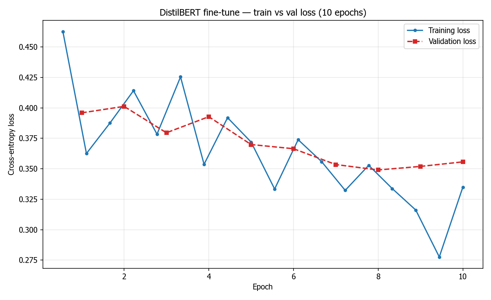

# FinDocs-Verify

Fine-tuned DistilBERT model for detecting payment-term mismatches in invoices. Trained on a small proprietary dataset of 632 receipt documents.

## Results



### Benchmark Metrics

| Metric | Value |
|--------|-------|
| Precision | 61.54% |
| Recall | 100.00% |
| F1-Score | **76.19%** |
| Accuracy | 84.13% |

### Fine-Tuning Impact

| Model | Precision | Recall | F1 |
|-------|-----------|--------|-----|
| DistilBERT (base) | 25.4% | 100% | 40.5% |
| **Ours** | **61.5%** | **100%** | **76.2%** |

+35.7pp F1 improvement. 100% recall — every discrepancy in the test set is caught.

## Quick Start

```bash
pip install -r requirements.txt
make train     # Fine-tune DistilBERT (GPU: ~43s, CPU: ~15min)
make eval      # Benchmark on held-out set
make test      # Run tests
make serve     # Start API on :8000
```

## API

```bash
curl -X POST http://localhost:8000/verify-invoice \
  -H "Content-Type: application/json" \
  -d '{"text": "3 x 50 = 150, but total shows 145"}'
```

```json
{"mismatch_detected": true, "confidence": 0.92, "recommendation": "Review manually"}
```

## Project Structure

```
data/processed/          # JSONL training data (632 records)
models/                  # Trained weights (generated by make train)
src/
  train.py               # Fine-tune DistilBERT (MLflow tracking, early stopping)
  evaluate.py            # Benchmark -> Markdown + JSON
  compare_models.py      # Baseline vs fine-tuned comparison
  serve.py               # FastAPI endpoint
  common.py              # Shared utilities
  viz.py                 # Loss chart with Arabic bidi text
tests/
  test_model.py          # Model loads + predicts correctly
  test_data.py           # Data schema validation
artifacts/               # Reports, logs, charts
```

## Hardware

- **GPU**: NVIDIA RTX 4060 (8GB VRAM)
- **Training**: ~43 seconds (10 epochs, 568 docs)
- **Inference**: <1 second per document
